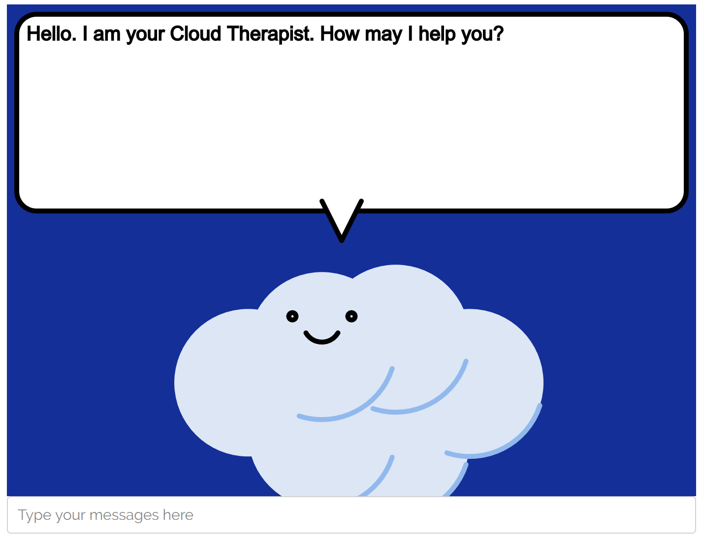

# cloud-therapist

A simple character that can have a conversation with you. Click [here](https://alinen.github.io/cloud-therapist/) to try the demo.

This application combines 

* a simple character, drawn and animated using [P5js](https://p5js.org), with 
* a simple chatbot, based on the [ELIZA algorithm](https://web.njit.edu/~ronkowit/eliza.html)

This application was developed as part of a workshop for Bryn Mawr College's 2022 
[STEM Posse Immersion Program](https://www.brynmawr.edu/inside/offices-services/posse-bryn-mawr).
